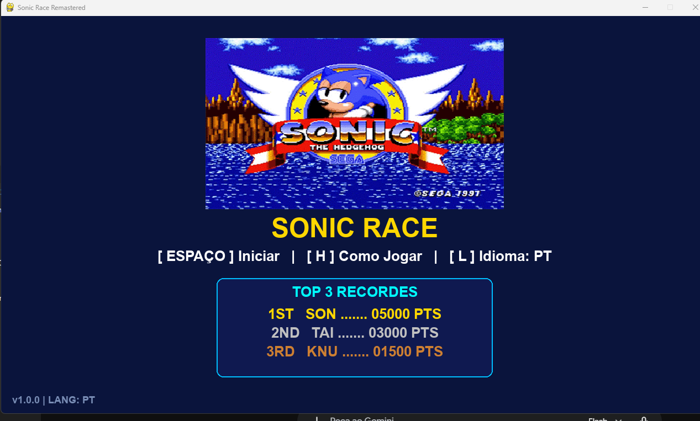
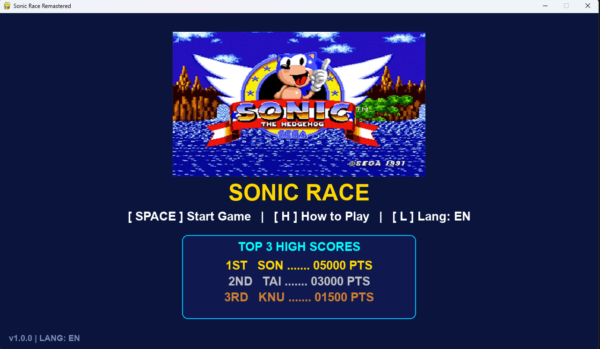
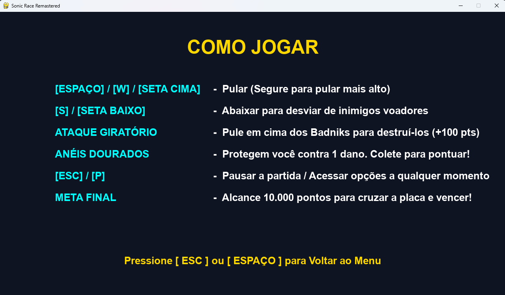
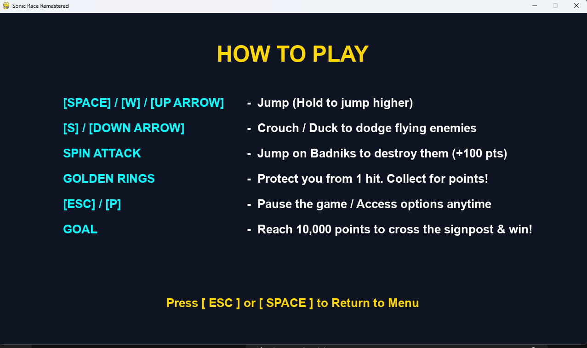
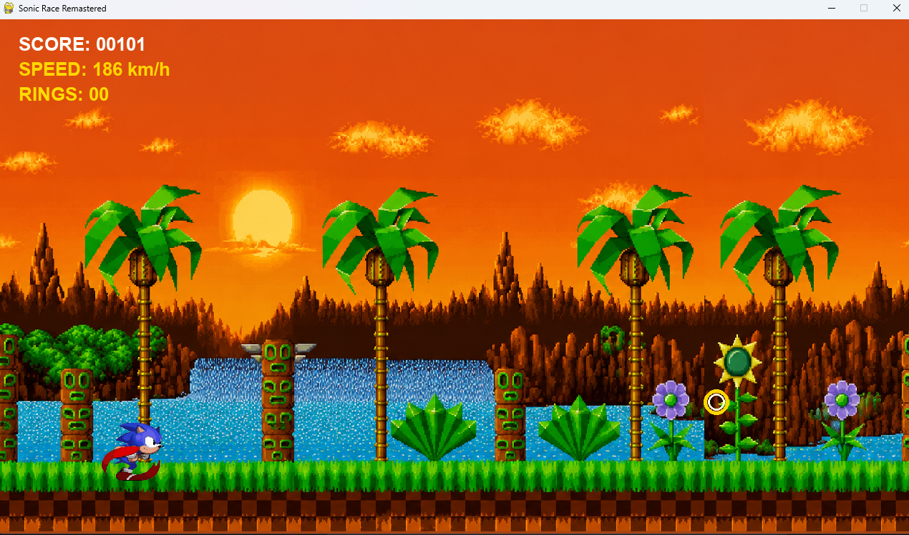
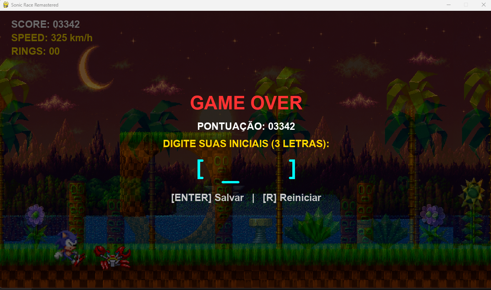
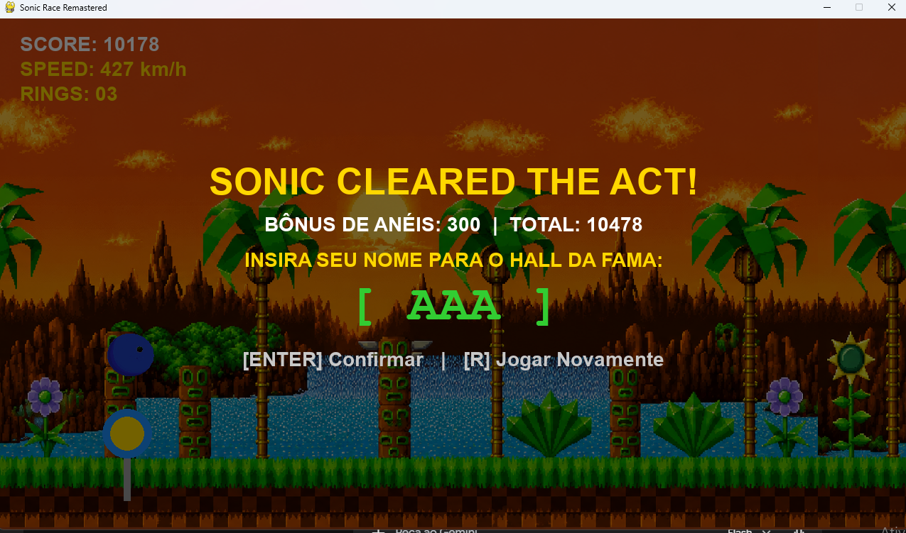
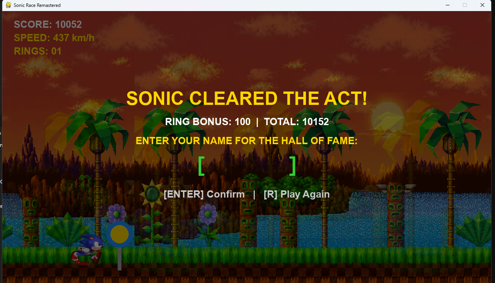

# 🦔 Sonic Race Remastered (v1.0.0)

An endless runner and 2D action game inspired by classic 16-bit Mega Drive titles, developed in **Python** and **Pygame**. Dodge Badniks, collect golden rings, defeat enemies with Spin Jump attacks, and compete for a spot in the Top 3 Arcade Hall of Fame!

---

## 🎮 How to Play

### Option 1: Standalone Download (No Python Required)
Download and play directly on Windows via GitHub Releases:
👉 **[Download SonicRace.exe (Latest Release)](https://github.com/Vasconcellos-cipher/Sonic-Racer/releases)**

### Option 2: Run from Source Code (Developers)
```bash
# 1. Clone this repository
git clone [https://github.com/Vasconcello--cipher/Sonic-Racer.git](https://github.com/Vasconcello--cipher/Sonic-Racer.git)
cd Sonic-Racer

# 2. Create and activate virtual environment
python -m venv venv
venv\Scripts\activate

# 3. Install dependencies
pip install -r requirements.txt

# 4. Start the game
python main.py

```

---

## 📸 Screenshots & Showcase

### 🏠 Main Menu & Top 3 High Scores (Bilingual Support: PT / EN)
| Main Menu (Portuguese) | Main Menu (English) |
| :---: | :---: |
|  |  |

---

### 📖 Instructions / How to Play Screen
| Como Jogar (PT) | How to Play (EN) |
| :---: | :---: |
|  |  |

---

### 🕹️ Fast-Paced Gameplay & Game Over Screen
| Sunset Zone Run (HD 16:9) | Game Over & Arcade Initials Entry |
| :---: | :---: |
|  |  |

---

### 🏆 Victory (Act Clear) & Hall of Fame
| Victory Screen (PT) | Victory Screen (EN) |
| :---: | :---: |
|  |  |

---

## 🕹️ Controls & Key Bindings

| Action | Key Bindings |
| --- | --- |
| **Jump / Spin Attack** | `SPACE`, `W`, or `UP ARROW` |
| **Variable High Jump** | Hold Jump Key |
| **Crouch / Duck** | `S` or `DOWN ARROW` |
| **Pause / Resume** | `ESC` or `P` |
| **Switch Language (PT / EN)** | `L` (on Main Menu) |
| **How to Play Screen** | `H` or `C` (on Main Menu) |
| **Restart Match** | `R` (on Pause, Game Over, or Victory) |
| **Return to Menu** | `M` (on Pause or Victory) |

---

## ✨ Key Features

* **HD Widescreen 16:9 (1280x720):** Sharp pixel assets and responsive collision masks locked at 60 FPS.
* **Spin Attack Mechanics:** Destroy ground and flying Badniks by bouncing on top of them (+100 pts + aerial boost).
* **Classic Ring Mechanics:** Shield against 1 lethal hit, +20 pts on pickup, and +100 bonus pts per stored ring upon act completion.
* **Smooth Parallax Scrolling:** Dual-layer background motion engineered for high-speed clarity without visual fatigue.
* **Local Arcade Hall of Fame:** Persistent JSON storage (`data/save.json`) for top 3 high scores with 3-letter initials (`[ AAA ]`).
* **Real-time Bilingual Localization:** Instant switching between Portuguese and English across all UI screens.

---

## 📦 License & Credits

Developed for educational and portfolio purposes. Character designs, sprites, and audio belong to © SEGA / Sonic the Hedgehog.

```
